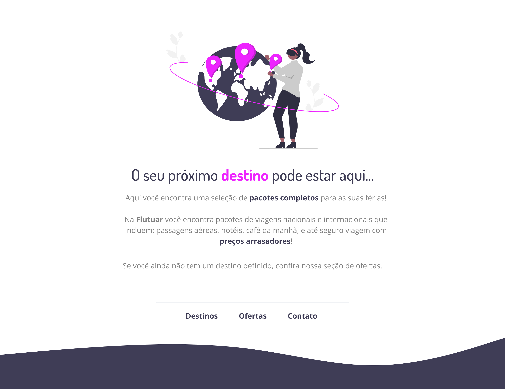

# 💻 Sobre o desafio

  Nesse desafio extra, foi entregue um layout no Figma de uma página simple com informações de viagem.

  <a href="#-tecnologias">Tecnologias</a>&nbsp;&nbsp;&nbsp;|&nbsp;&nbsp;&nbsp;
  <a href="#-projeto">Projeto</a>&nbsp;&nbsp;&nbsp;|&nbsp;&nbsp;&nbsp;
  <a href="#-layout">Layout</a>&nbsp;&nbsp;&nbsp;|&nbsp;&nbsp;&nbsp;

 

  

  

## 🚀 Tecnologias

Esse projeto foi desenvolvido com as seguintes tecnologias:

- HTML e CSS
- JavaScript
- Git e Github
- Figma
   

## 💻 Projeto

O Viajar.com é um projeto simples de layout, para testar conhecimentos basicos e a implementação desse layout foi um desafio proposto como projeto extra.

## 🔖 Layout

   
  Você pode visualizar o layout do projeto através [<a href="https://www.figma.com/file/waisYRoNzeBgIxOyrz0b2R/Projeto01-Extra/duplicate">DESSE LINK</a>]
  É necessário ter conta no [<a href="https://figma.com">Figma</a>] para acessá-lo.
    
---
 

Feito com ♥ by Lucas Sampaio at Rocketseat
